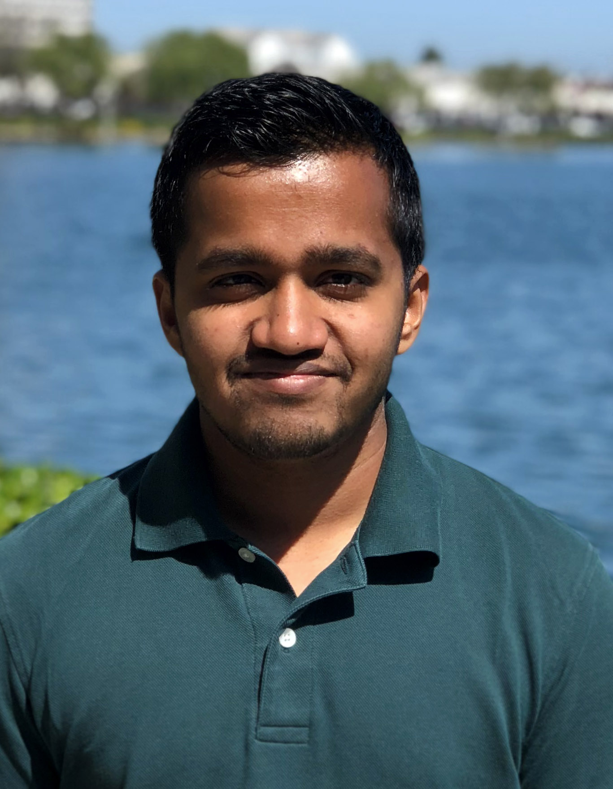

I plan to use this blog to praise, complain, rant about software, CS, academia, research, systems, and whatever interests me. This will also be a way for me to document my PhD journey.

# Current
</img>

Hi, my name is Devashish Purandare, but you can call me Dev (like they've) !

I am a PhD student in the Computer Science department at University of California Santa Cruz.
Since Spring 2017, I have been a part of the [Storage Systems Research Center](https://ssrc.ucsc.edu) and the [Center for Research in Storage Systems](https://crss.ucsc.edu).
Since 2017, I have worked with [CERN](https://home.cern) on Trace Analysis of large scale archives.

I will soon be starting a new project on Quad-Level-Cell (QLC) flash and how to reason about limited durability.
My reseach interests lie broadly in storage, operating systems, programming languages and distributed systems.
Further, I love to work with graphics, image processing, and machine learning.

You can see my research details here : [research](../research)

On the side, I am working on making tech more accessible, and easy, the projects for which can be found here and here.

You can reach me at [email](mailto:devashish+website@ucsc.edu) or [Twitter @dev14e](https://twitter.com/dev14e).

My LinkedIn is [devashishp](https://linkedin.com/in/devashishp) and so is my [github](https://github.com/devashishp).

My research profile is available on the [SSRC website](https:/ssrc.ucsc.edu/person/Dev.html) and my google scholar profile will be [here](https://scholar.google.com/citations?user=uShaD2gAAAAJ) once I populate it.

Last updated : 9th July 2018

# History

I completed Bachelor's in Computer Engineering from the [University of Pune](https://unipune.ac.in) in 2016. My senior project involved improving an image similarity algorithm to much faster while trading off some accuracy. Parts of the project which are public are available [here.](https://github.com/devashishp)

I can speak Marathi, Hindi, and English with native fluency, and can understand Sanskrit and Spanish and most north Indian languages. I love taking pictures, and hiking.

# Ancient History

I was born in 1994 in Pune, India. I grew up with a 486 machine, with Windows 3.11. I used to spend my days in a Net Café (pre 2011) and on internet at my home when we got it in 2011.

I picked CS for high school, then for Bachelor's, Master's and now PhD. There might be a pattern here. I spent my free time being an editor for the school magazine and learning spanish.
